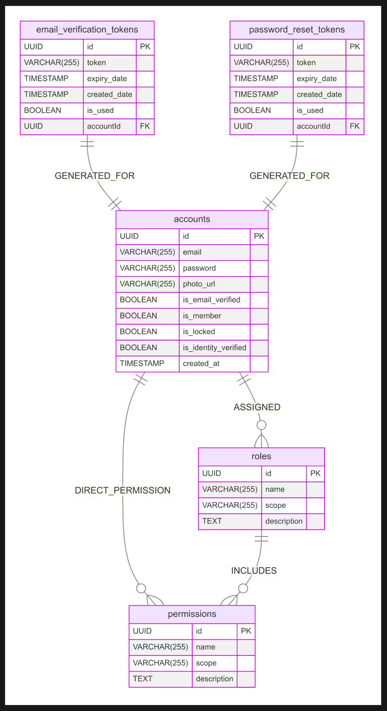
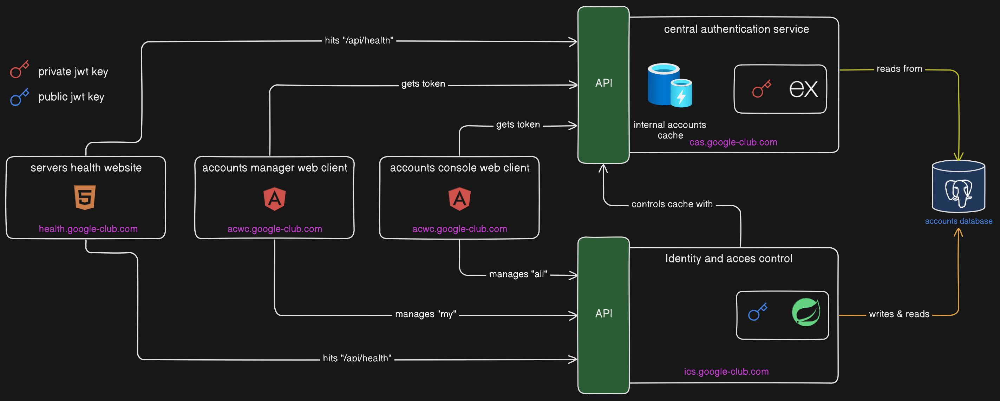

## Architecture

The **Google Club Unified Access System (UAS)** employs a structured architecture to manage authentication, authorization, and identity services. The system consists of two primary services, a shared database, and client interfaces designed for both users and admins, providing a secure, cohesive experience.

### Core Services

1. **CAS (Central Authentication Service)**

- **Purpose**: CAS handles authentication, using JWT (JSON Web Token) for secure token-based authentication.
- **Features**:
  - **Fast Access to Authorities**: CAS provides quick access to user authorities, ensuring low latency.
  - **Cache & Authority Control**: Caches user authorities to reduce load on the database and optimize performance.
- **Technology**: Built with **Express.js** for lightweight and efficient operation.

2. **ICS (Identity Control Service)**

- **Purpose**: ICS focuses on managing identity and access control for both users and administrators.
- **Features**:
  - **Access Management**: Configures and verifies authorities for integrated applications, with database checks to ensure accurate permissions.
  - **Comprehensive Identity Management**: Manages user profiles, permissions, and administrative controls.
- **Technology**: Developed with **Spring Boot** for robust backend support and efficient data handling.

### Shared Database

Both CAS and ICS utilize a centralized **Accounts Database** (PostgreSQL), storing essential user data and access control information with durability and security:

- **Account Information**: Holds user profiles and core account data.
- **Access Authorities**: Manages permissions across Google Club applications to ensure unified, up-to-date access control.

**Database Structure**  

### Client Interfaces

The system includes two main Angular-based clients to allow users and administrators complete control over their accounts and permissions within Google Club:

1. **AMWC (Account Manager Web Client)**

- **Audience**: End-users.
- **Purpose**:
  - Control over account details.
  - View authorities.
  - Single Sign-On (SSO) access across the ecosystem.

2. **ACWC (Accounts Console Web Client)**

- **Audience**: Administrators.
- **Purpose**:
  - Identity verification, account management, and authority controls.
  - Granting, revoking, and managing permissions.
  - Analyzing user data and trends.

### API Endpoints

Each service has dedicated APIs to facilitate requests and operations across the UAS system:

# Identity and Access Control Server

- **[ICS API Endpoints](./images/ics-api-endpoints.png)** - Click to view ICS API endpoints in Postman.

## 1. General Purpose

- **GET** `/health-check`  
  Health check for the server.

## 2. Account Manager

### 2.1 Account Management

- **POST** `/create-account`  
  Create a new account.
- **POST** `/request-reset-password`  
  Request a password reset.
- **POST** `/reset-password-with-token`  
  Reset password using a token.
- **POST** `/request-email-verification`  
  Request email verification.
- **GET** `/verify-email-with-token`  
  Verify email with a token.
- **GET** `/get-my-account`  
  Retrieve personal account information.
- **POST** `/change-my-password`  
  Change account password.
- **PUT** `/update-my-account`  
  Update personal account information.
- **DELETE** `/delete-my-account`  
  Delete the account.

### 2.2 Accounts Console

#### 2.2.1 Account Management

- **GET** `/search-accounts`  
  Search for accounts.
- **GET** `/get-account-by-id`  
  Get account details by ID.
- **POST** `/edit-authorities`  
  Edit account authorities.
- **POST** `/toggle-verify-identity`  
  Toggle identity verification status.
- **POST** `/toggle-membership`  
  Toggle membership status.
- **POST** `/lock-account`  
  Lock an account.

#### 2.2.2 Role Management

- **GET** `/search-roles`  
  Search for roles.
- **POST** `/create-role`  
  Create a new role.
- **GET** `/get-role-by-id`  
  Get role details by ID.
- **POST** `/edit-role`  
  Edit an existing role.
- **DELETE** `/delete-role`  
  Delete a role.

#### 2.2.3 Permission Management

- **GET** `/search-permissions`  
  Search for permissions.
- **POST** `/create-permission`  
  Create a new permission.
- **GET** `/get-permission-by-id`  
  Get permission details by ID.
- **DELETE** `/delete-permission`  
  Delete a permission.

---

# Centralized Authentication Service

- **[CAS API Endpoints](./images/cas-api-endpoints.png)** - Click to view CAS API endpoints in Postman.

## 1. General Purpose

- **GET** `/health-check`  
  Health check for the service.

## 2. Cache Management

- **GET** `/get-all-accounts-ids-in-cache`  
  Retrieve all account IDs from cache.
- **GET** `/get-account-cached-authorities`  
  Get cached authorities of an account.
- **DELETE** `/clear-all-accounts-cache`  
  Clear the cache for all accounts.
- **DELETE** `/clear-account-cache`  
  Clear the cache for a specific account.

## 3. Authentication Management

- **POST** `/generate-jwt-token`  
  Generate JWT token (login).
- **GET** `/get-authorities`  
  Retrieve authorities for an account.
- **GET** `/verify-token`  
  Verify the validity of a token.

### System Communication

The UAS architecture supports smooth communication between the CAS, ICS, the shared database, and client interfaces. This integrated design supports real-time updates and centralized control over identity and access management.

**Architecture Communication**  

_"The integration of CAS, ICS, and the Accounts Database, along with client interfaces, creates a secure, scalable, and efficient UAS ecosystem for the Google Club."_

Currently managed by [Wassim Rached](https://www.wassimrached.me).
